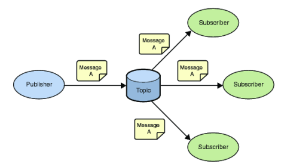

Паттерн проектирования

## Observer (Наблюдатель)

* Связь объектов по принципу «publish/subscriber» (издатель/подписчик)
* Наблюдатель ждет наступления определенного события и оповещает об этом всех слушателей
* Помогает реализовать слабую зависимость между объектами
* Определяет зависимость типа «один ко многим» между объектами таким образом, что при изменении состояния одного объекта все зависящие от него оповещаются об этом событии

